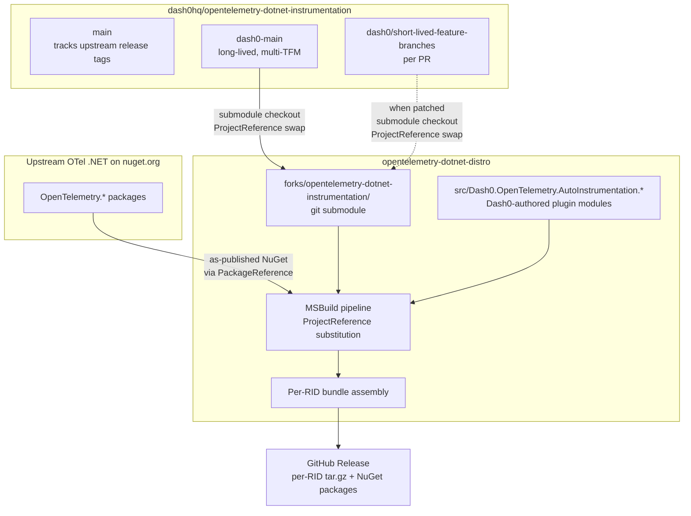
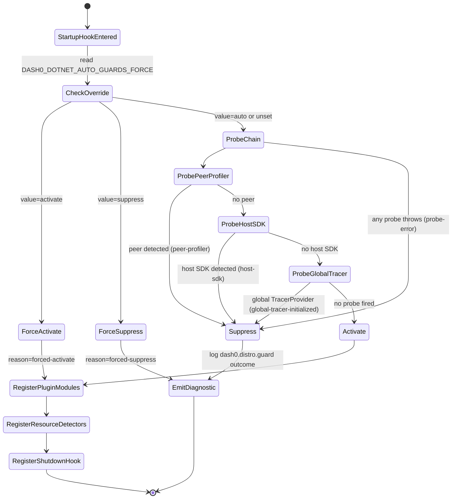

# feat: Dash0 OpenTelemetry .NET Distro (v1)

## Summary

Build v1 of the Dash0 OpenTelemetry .NET auto-instrumentation distribution. The shipped artifact is per-RID Linux bundles (`linux-x64`, `linux-arm64`, `linux-musl-x64`, `linux-musl-arm64`) plus macOS bundles for dev-machine testing (`osx-x64`, `osx-arm64`) — no Windows in v1. Each bundle is a `dash0-opentelemetry-dotnet-autoinstrumentation-<rid>.tar.gz` drop-in for upstream's `opentelemetry-dotnet-instrumentation` bundle, injected via the standard `CORECLR_*` / `DOTNET_STARTUP_HOOKS` / `OTEL_DOTNET_AUTO_HOME` env-var surface unchanged.

v1 delivers the four brainstorm payoffs: `.NET 6+` runtime support (via the single `dash0-main` fork branch — M0 validated), activation guards preventing double-activation, augmented resource detection, and flush-on-shutdown. A minimal `Dash0.OpenTelemetry.AutoInstrumentation` NuGet set is also published to GitHub Release for library-mode users.

Supply chain: Sigstore keyless signing via GitHub OIDC, CycloneDX SBOM, SLSA level 2 provenance.

---

## Problem Frame

Origin: `docs/brainstorms/2026-07-17-dash0-otel-dotnet-distro-requirements.md`.

Dash0's current .NET posture wraps upstream's OpenTelemetry auto-instrumentation via the Kubernetes operator; there is no Dash0-authored .NET instrumentation shipped today. Two triggers change that: (1) Microsoft's LTS/STS cadence keeps stranding enterprise customers on `.NET 6` (and, by November 2026, `.NET 8` LTS) — upstream drops runtimes on that schedule and this distro exists to close the gap indefinitely; (2) upstream cannot merge Dash0-authored instrumentation at the pace customer pain requires.

The distro is Linux-first with macOS bundles for dev-machine testing only; Windows and `.NET Framework` are out of v1 (Q_S1 resolved 2026-07-17). The `.NET 6+` support policy is a **standing commitment** across all current and future .NET major versions from 6 upward — implemented as a single `dash0-main` branch on the Dash0 fork of `opentelemetry-dotnet-instrumentation` that multi-targets every extended runtime in one source tree.

M0 (runtime-support feasibility spike) already ran on 2026-07-17 and validated `.NET 6` inclusion — see `docs/spikes/2026-07-17-m0-net6-feasibility.md`. M1 (substitution-mechanism spike, was origin Q10) is the remaining pre-scaffolding gate and is U1 of this plan.

---

## Scope Boundaries

**In this plan (v1 scope):**
- Per-RID Linux bundles + macOS bundles.
- Minimal Dash0-branded NuGet packages (`Dash0.OpenTelemetry.AutoInstrumentation`, `.Loader`) — published to GitHub Release, not `nuget.org`.
- `dash0-main` fork branch, promoted from local M0 spike to the real `dash0hq/opentelemetry-dotnet-instrumentation` fork.
- Activation guards (R7), flush-on-shutdown (R8), resource detection augmentation (R6).
- Canonical-application diff harness across the R21 runtime matrix.
- CI/CD release workflow with per-RID native+managed bundle assembly.
- Sigstore + CycloneDX SBOM + SLSA-2 provenance.
- Version manifest, `SUPPORTED-RUNTIMES.md`, `distro.md`, README, verification docs.

**Deferred for later** (from origin — carry forward):
- Bootstrap span.
- Telemetry curation as cost optimization at source.
- Native AOT support (structurally incompatible with the profiler).
- Configuration profiles.
- `nuget.org` publication.
- SLSA level 3.
- Automated CVE-triage cadence independent of upstream releases.

**Outside this product's identity** (from origin — carry forward):
- Windows support (no `win-*` bundles, no `.NET Framework`).
- `.NET Core 3.1` and earlier (below the `.NET 6+` floor).
- Proprietary agent diverging from OpenTelemetry semantic conventions or wire format.
- OpAMP-based remote SDK configuration.
- The `-distro` repo is not a fork of any upstream repository.
- OCI image packaging (done by the operator repo, not here).
- "Smart Dash0-only" mode.

**Deferred to Follow-Up Work** (plan-local implementation sequencing):
- Runtime-support-branch conflict escalation tooling beyond the basic rebase workflow (Q13 refinement past v1).
- Metadata-driven upstream PR staging automation (Q4 refinement past v1).
- Automated fork-checkout mechanism beyond git submodule if the ergonomics prove painful (Q9 refinement).

---

## Key Technical Decisions

### KTD1. MSBuild `<ProjectReference>` substitution via git-submodule fork checkout

The `-distro` repo consumes upstream OpenTelemetry .NET modules as ordinary NuGet packages from `nuget.org` at their `OpenTelemetry.*` package IDs. For modules Dash0 patches (specifically the `dash0-main` branch), the build consumes the corresponding fork checkout via git-submodule under `forks/` + `<ProjectReference>` swap driven by `Directory.Packages.props` overrides.

**Rationale:** origin R13. Mirrors the Java distro's Gradle-composite-build model in a .NET-native way — MSBuild's `<PackageVersion>` and `<ProjectReference>` are standard, and submodules give reviewable pinning per release. No Maven/NuGet-alternate-feed to stand up.

**M1 gate:** U1 spikes this mechanism against a trivial patched module before U2+ commit to it. Fail-fast: if `<ProjectReference>` substitution against a submodule-checked-out fork does not produce correct bundle output (package-ID collisions, plugin discovery failure, ALC isolation break, or drop-in behavioral drift), pivot to a local NuGet feed model (Alternatives).

### KTD2. Single `dash0-main` runtime-support branch, multi-target source tree

One long-lived branch on the affected fork(s) carries the entire `.NET 6+` policy. Upstream's `<TargetFrameworks>net8.0</TargetFrameworks>` becomes `<TargetFrameworks>net6.0;net7.0;net8.0;net9.0;net10.0</TargetFrameworks>` on the branch; `#if` guards handle per-version BCL API gaps. As new .NET majors ship and eventually EOL, they enter this branch via TFM addition — no new branch per runtime.

**Rationale:** origin Key Decision + Q_S1 resolution + M0 spike evidence. Per-runtime branches would duplicate the same edits to the same upstream source files, produce combinatorial rebase pain, and force a merge for a single-artifact injector bundle. The M0 spike confirmed the multi-target pattern works (see `docs/spikes/2026-07-17-m0-net6-feasibility.md`).

**Reason code:** `dash0-carry` recorded in the branch's `.dash0-branch-meta.yaml`. Branch is exempt from R11 upstream-PR requirement.

### KTD3. Activation guard lives at the managed startup-hook layer

R7's three probe families (peer profiler, host-registered SDK, initialized global `TracerProvider`) fire from the managed startup-hook, not the native CLR profiler. Suppression means: the startup hook returns before registering plugin modules, resource detectors, and the shutdown handler.

**Rationale:** the startup-hook layer has full managed-side reflection access to detect loaded assemblies and initialized `TracerProvider` globals. Native-layer probes would require duplicating detection logic in C++ against CLR APIs, are harder to test, and offer no earlier detection point for host-SDK / global-tracer cases (which by definition materialize after native profiler startup anyway). Peer-profiler detection at the native layer is the one exception where earlier detection *would* matter — but the standard `CORECLR_PROFILER` GUID contract already prevents two profilers from loading via the runtime's own mechanism, so a native-layer probe here would be belt-and-suspenders. Deferred as follow-up if empirical evidence warrants.

**Failure mode:** fail-closed (probe exception → suppress with `probe-error` reason code). User override via `DASH0_DOTNET_AUTO_GUARDS_FORCE=activate|suppress|auto`.

### KTD4. Per-RID bundle assembly via MSBuild `dotnet publish` with runtime identifier + native binary co-pack

Each bundle is assembled by (a) running `dotnet publish -r <rid>` for the managed-side projects targeting each TFM in R21, (b) copying the CMake-built native profiler for `<rid>` into the bundle root, (c) copying the upstream-shipped `instrument.sh` (Dash0-adjusted), (d) writing the version manifest, and (e) `tar czf`-ing the result.

**Rationale:** upstream's own build follows a similar shape; Dash0 preserves the layout so the injector's `OTEL_DOTNET_AUTO_HOME` expectations remain satisfied without any injector-side changes.

### KTD5. Startup-hook shutdown handler pairs with existing SDK Dispose

Flush-on-shutdown (R8) registers an `AppDomain.ProcessExit` handler in the startup hook. When an `IHost` is detected in the process, additionally hook `IHostApplicationLifetime.ApplicationStopping` for earlier flush. The handler calls the underlying OpenTelemetry SDK providers' `Dispose()` chain with a bounded wait (default 5s; env-configurable via `DASH0_DOTNET_SHUTDOWN_TIMEOUT_SECONDS`).

**Rationale:** origin R8. `Dispose` on `TracerProvider`/`MeterProvider`/`LoggerProvider` invokes `Shutdown` with the configured timeout on all registered processors and exporters; this is the standard OTel .NET flush path. Adding a bounded wait prevents shutdown-hook hangs on unreachable OTLP endpoints.

### KTD6. `.dash0-branch-meta.yaml` schema for every consumed fork branch

Every fork branch the `-distro` consumes (short-lived feature or long-lived `dash0-main`) carries a metadata file at branch root:

```yaml
upstream_base_tag: v1.13.0
reason: dash0-carry     # or "upstream-pr:https://github.com/open-telemetry/opentelemetry-dotnet-instrumentation/pull/5432"
depends_on_prs: []                   # PRs that must land before this can PR upstream
conflicts_on_rebase: []              # PRs to watch during rebase
```

**Rationale:** origin R10 + R11. Build-time validator reads this at MSBuild configuration time and fails the build if `upstream_base_tag` diverges from the `-distro`'s currently pinned upstream version. `reason: dash0-carry` is the R11 exemption.

### KTD7. Canonical-application diff test is the R2 / R16 / R17 acceptance gate

A fixed set of small reference apps — one representative per extended runtime (`net6.0`, `net7.0`, `net8.0`, `net9.0`), one per key instrumentation (`AspNetCore`, `HttpClient`, `SqlClient`, `EntityFrameworkCore`, `Grpc.Net.Client`, `StackExchangeRedis`) — is run under (a) the outgoing distro release and (b) the incoming distro release, and the emitted OTLP payloads are diffed for shape drift.

**Rationale:** origin R2, R16, R17, S1. Encoded as a runnable harness rather than a documented promise. Non-zero diff blocks the release cut with an explicit accept/defer decision surface.

### KTD8. Dash0 premain equivalent — the startup hook is the single managed entry point

.NET's `DOTNET_STARTUP_HOOKS` mechanism gives us a managed entry point (`StartupHook.Initialize` static method) that runs before Main. This is where activation-guard probes run, plugin registration happens on activate, and the shutdown handler is registered. Startup hook is compiled `netcoreapp3.1` (works everywhere from .NET Core 3+); no runtime-specific startup-hook variants needed.

**Rationale:** upstream's startup hook already sits at this position; Dash0 augments it rather than replacing it. Keeps the injection contract identical to upstream.

---

## High-Level Technical Design

### Multi-repo topology



### Activation-guard state machine



### Bundle layout

```
dash0-opentelemetry-dotnet-autoinstrumentation-<rid>/
├── instrument.sh                          # Dash0-adjusted upstream script
├── VERSION                                # Semver of the distro release
├── META-INF/
│   └── dash0-distro-manifest.properties   # See KTD1's manifest keys
├── linux-x64/                              # Native profiler for this RID
│   └── Dash0.OpenTelemetry.AutoInstrumentation.Native.so
├── net/                                    # Managed for .NET Core+ (all TFMs)
│   ├── net6.0/
│   ├── net7.0/
│   ├── net8.0/
│   ├── net9.0/
│   └── net10.0/
│       ├── Dash0.OpenTelemetry.AutoInstrumentation.dll
│       ├── Dash0.OpenTelemetry.AutoInstrumentation.Loader.dll
│       ├── Dash0.OpenTelemetry.AutoInstrumentation.StartupHook.dll
│       └── <upstream OTel deps at correct TFM>
```

The bundle is bit-for-bit reproducible given the same source commits (submodule commit + `-distro` commit); Sigstore + reproducibility together satisfy S6.

---

## Output Structure

Greenfield `opentelemetry-dotnet-distro` repo layout:

```
opentelemetry-dotnet-distro/
├── docs/
│   ├── brainstorms/
│   │   └── 2026-07-17-dash0-otel-dotnet-distro-requirements.md
│   ├── plans/
│   │   └── 2026-07-17-001-feat-dash0-otel-dotnet-distro-plan.md
│   ├── spikes/
│   │   └── 2026-07-17-m0-net6-feasibility.md
│   ├── branching-model.md
│   ├── downstream-consumer-contract.md
│   ├── rebase-runbook.md
│   ├── release-process.md
│   ├── telemetry-diff-spec.md
│   └── verification.md
├── src/
│   ├── Dash0.OpenTelemetry.AutoInstrumentation/          # Managed additions to plugin surface
│   ├── Dash0.OpenTelemetry.AutoInstrumentation.Loader/   # Startup hook loader + guard entry
│   ├── Dash0.OpenTelemetry.AutoInstrumentation.ResourceDetectors/  # R6 additions
│   └── Directory.Build.props
├── test/
│   ├── Dash0.OpenTelemetry.AutoInstrumentation.Tests/
│   ├── Dash0.OpenTelemetry.AutoInstrumentation.Loader.Tests/
│   ├── canonical-apps/                                    # Reference apps for R16 diff
│   └── Directory.Build.props
├── build-config/
│   ├── patched-modules.yaml                               # KTD1 substitution registry
│   ├── ResourceGeneration/
│   └── RID-Configuration/
├── build/
│   ├── Build.NuGet.Steps.cs
│   ├── Build.Steps.Linux.cs
│   ├── Build.Steps.MacOS.cs
│   ├── Build.Steps.cs                                     # Nuke or PowerShell orchestrator
│   └── _build.csproj
├── nuget/
│   └── Dash0.OpenTelemetry.AutoInstrumentation/           # NuGet packaging assets
├── forks/
│   └── opentelemetry-dotnet-instrumentation/              # git submodule
├── .github/
│   └── workflows/
│       ├── ci-linux.yml
│       ├── ci-macos.yml
│       └── release.yml
├── .gitmodules
├── Directory.Build.props
├── Directory.Packages.props
├── Dash0.OpenTelemetry.AutoInstrumentation.sln
├── SUPPORTED-RUNTIMES.md
├── distro.md
├── README.md
├── CONTRIBUTING.md
├── AGENTS.md
└── LICENSE
```

The `forks/` submodule contents are not committed to this repo; they are checked out by `git clone --recurse-submodules`.

---

## Requirements Traceability

Every load-bearing origin requirement is addressed. Cross-reference table:

| Origin | Addressed in |
|---|---|
| R1 (per-RID bundles + NuGet) | U3, U9, U10 |
| R2 (drop-in default surface) | U3, U8, U13 (harness) |
| R3 (GitHub Release publication) | U10 |
| R4 (version manifest) | U3 |
| R5 (plugin-loaded instrumentations vs fork-branch fallback) | U6, U13, U14 |
| R6 (resource detection augmentation) | U8 |
| R7 (activation guard, 3 probe families, override, fail-closed) | U6 |
| R8 (flush-on-shutdown) | U7 |
| R9 (rebase on every upstream release) | U12 |
| R10 (branch metadata schema) | U4 |
| R11 (upstream-PR reference required, `net6plus-support` exempt) | U4 |
| R12 (Dash0 extension module layout mirrors upstream) | U6 |
| R13 (NuGet + `<ProjectReference>` substitution) | U1 (spike), U5 (wiring) |
| R14 (branching model) | U4, U14 |
| R15 (rebase + delete-merged-branches workflow) | U12 |
| R16 (canonical-app diff gate) | U9 |
| R17 (upstream telemetry-shape delta accept/defer) | U9, U12 |
| R18 (Sigstore + SHA + SBOM + SLSA-2) | U11 |
| R19 (stable signing identity + SBOM format) | U11 |
| R20 (redistributor preserves bit-for-bit) | U3 (reproducible build), U11 |
| R21 (`.NET 6+` runtime set) | U2 |
| R22 (`.NET 6+` policy in SUPPORTED-RUNTIMES.md) | U15 (docs) |
| R23 (Dash0-authored instrumentations target full R21) | U6, U13 |
| R24 (shape parity across runtimes) | U9 |
| F1 (bootstrap + guard flow) | U6, U7 |
| F2 (release cut against new upstream) | U12 |
| F3 (upstream merges Dash0 PR) | U12 |
| F4 (authoring an instrumentation) | U13 |
| F5 (runtime-support-branch rebase) | U12 |
| F6 (runtime retirement) | U15 (policy doc); tooling deferred |
| AE1-AE6 (activation, rebase, drop-in) | Test scenarios in U6, U8, U12, U13 |
| S1-S6 (success criteria) | U9 (S1, S2), U13 (S3), U4 (S4), U11 (S5, S6) |
| M0 (feasibility spike) | Done — see `docs/spikes/2026-07-17-m0-net6-feasibility.md` |
| M1 (substitution spike) | U1 |
| Q1-Q14 (deferred to planning) | Resolved inline in U-notes or explicitly deferred in Open Questions |

---

## Implementation Units

Units are phased into four bands: **A. Foundation** (U1-U4), **B. Product features** (U5-U9), **C. Release path** (U10-U12), **D. First real content + polish** (U13-U15). Each phase ends with a working, testable milestone.

### U1. M1 substitution-mechanism spike

- **Goal:** Verify MSBuild `<ProjectReference>` substitution against a git-submodule-checked-out fork produces a correct bundle. Fail-fast per KTD1 before any scaffolding is invested.
- **Requirements:** Origin M1 (was Q10 — the substitution-mechanism spike).
- **Dependencies:** None. **This unit blocks U2+.**
- **Files (in a scratch `spike/` directory, kept until U2 lands and then archived under `docs/spikes/`):**
  - `spike/build.props`
  - `spike/Directory.Packages.props`
  - `spike/spike.sln`
  - `spike/patched-module/` — a trivial patched copy of one small upstream instrumentation module
  - `spike/SPIKE-RESULTS.md` — verification report
- **Approach:**
  - Clone `opentelemetry-dotnet-instrumentation` at the current pinned release into `spike/upstream-checkout/` (throwaway; not a submodule for the spike itself).
  - Pick TWO patched-module cases:
    - **Case A (trivial):** a small leaf module patch — add a marker attribute or version-marker log line.
    - **Case B (harder):** a module patch that modifies an existing span attribute (not adds), and where the module has a cross-project dependency on `OpenTelemetry.AutoInstrumentation.PluginApi`. Exercises Assembly Load Context isolation and `[GeneratedCode]` boundary crossing.
  - Configure `spike/Directory.Packages.props` with `<PackageVersion>` overrides pointing at the fork's project paths (or use `<ProjectReference>` in the spike csproj directly, whichever proves cleaner — the spike documents which works).
  - Assemble the spike bundle. Run it via `CORECLR_PROFILER_PATH` against two trivial test apps.
  - Document findings in `spike/SPIKE-RESULTS.md`: what worked, package-ID collisions if any, plugin discovery notes, ALC isolation observations, whether the patched attribute reached the OTLP output.
- **Execution note:** Start with a failing integration test — the trivial patched module's marker appearing in a captured OTLP payload from the spike bundle is the acceptance signal.
- **Patterns to follow:** Upstream's `src/OpenTelemetry.AutoInstrumentation/OpenTelemetry.AutoInstrumentation.csproj` conditional `PackageReference` structure (line 60 in the current tree).
- **Test scenarios:**
  - `Covers M1 case A.` Spike bundle loaded via `CORECLR_PROFILER_PATH` on a trivial test app emits telemetry containing the patch's marker attribute; the same test app under upstream's unpatched bundle does NOT emit the marker. Confirms `<ProjectReference>` swap actually happened.
  - `Covers M1 case B.` Spike bundle loaded on a test app exercising the harder-case library emits telemetry with the *modified* existing attribute (not the upstream default). Confirms the substitution reaches modules with cross-project dependencies and that ALC isolation holds.
  - `dotnet publish` completes for the spike bundle across `net6.0` through `net9.0` without package-ID collisions.
  - No `TypeLoadException`, `FileLoadException`, or "assembly with the same name already loaded" errors during startup-hook execution in either case.
  - Bundle contents check: only ONE copy of the patched managed assembly is present per case; upstream's version is not shadowed alongside.
- **Verification:** `spike/SPIKE-RESULTS.md` records "KTD1 mechanism verified end-to-end" only when both cases pass. If Case A passes but Case B fails, the plan pivots to a **local NuGet feed** substitution model (build patched modules into a local `.nupkg` feed consumed via `nuget.config`) and re-plans U5. If both fail, escalate — the multi-repo model itself needs re-evaluation.

### U2. Promote M0 spike patches to real `dash0hq` fork

- **Goal:** Create `dash0hq/opentelemetry-dotnet-instrumentation` fork; land the finished `dash0-main` branch containing the M0 spike patches plus the remaining `#if NET8_0_OR_GREATER` narrowings and any missed sites; verify a clean `dotnet build` across `net6.0;net7.0;net8.0;net9.0` on Linux.
- **Requirements:** R14 (branching model), R15 (branch persistence), R21 (`.NET 6+` runtime set), R23 (instrumentations target full R21), KTD2. Success criterion S2.
- **Dependencies:** U1.
- **Files (on the fork, `dash0hq/opentelemetry-dotnet-instrumentation`, branch `dash0-main`):**
  - `.dash0-branch-meta.yaml` (new — schema defined in U4)
  - `Directory.Build.props` — `LangVersion` handling (see spike notes)
  - `src/Directory.Build.props` — TFM set expansion
  - `src/Directory.Packages.props` — per-TFM `Microsoft.NETCore.Platforms` split, and other per-TFM version overrides discovered
  - `src/OpenTelemetry.AutoInstrumentation.Loader/OpenTelemetry.AutoInstrumentation.Loader.csproj`
  - `src/OpenTelemetry.AutoInstrumentation.AspNetCoreBootstrapper/OpenTelemetry.AutoInstrumentation.AspNetCoreBootstrapper.csproj`
  - `src/OpenTelemetry.AutoInstrumentation.Assemblies/OpenTelemetry.AutoInstrumentation.Assemblies.csproj`
  - `src/OpenTelemetry.AutoInstrumentation/OpenTelemetry.AutoInstrumentation.csproj` (broadened conditional PackageReferences)
  - `src/OpenTelemetry.AutoInstrumentation/**/*.cs` — targeted `#if` narrowings for `CompositeFormat`, `GeneratedRegex`, `SearchValues`, and any other .NET 8+ APIs surfaced during the finish-off
  - `src/OpenTelemetry.AutoInstrumentation/.publicApi/net{6,7,9}.0/PublicAPI.{Shipped,Unshipped}.txt` stubs
- **Approach:**
  - Fork the upstream repo to `dash0hq/`. Push the fork's upstream-tracking branch (`main`) fast-forwarded to the current upstream release tag.
  - Cut `dash0-main` off the upstream-tracking branch at that tag.
  - Rebase the M0 spike patches from the local clone onto this branch. Complete the remaining `#if NET8_0_OR_GREATER` narrowings (particularly in `src/OpenTelemetry.AutoInstrumentation/Instrumentations/AdoNet/Contrib/SqlProcessor.cs` — the spike stopped at ~2 of ~8 sites).
  - Add `.dash0-branch-meta.yaml` with `reason: dash0-carry` and `upstream_base_tag: <current tag>` per KTD6.
  - Run `dotnet build` for the full solution across `net6.0`, `net7.0`, `net8.0`, `net9.0` on Linux (glibc). Ensure ZERO errors. Document any per-TFM warnings deemed acceptable.
- **Execution note:** Characterization-first — before adding polyfills, run the existing upstream test suite against `net8.0` to establish baseline behavior. After polyfills land, the same test suite must pass on `net6.0` through `net9.0`.
- **Patterns to follow:** The M0 spike's edits under the local `dash0-main` branch on the throwaway clone. `docs/spikes/2026-07-17-m0-net6-feasibility.md` lists every touched file.
- **Test scenarios:**
  - `dotnet build src/OpenTelemetry.AutoInstrumentation.sln -c Release` completes with zero errors across `net6.0`, `net7.0`, `net8.0`, `net9.0` on a fresh Linux checkout of the branch.
  - Upstream's existing xunit test suite passes on `net6.0`, `net7.0`, `net9.0` (in addition to the known-passing `net8.0`). Failures per (test, TFM) cell are triaged: fix at the polyfill site, or file as follow-up.
  - `Covers AE4.` A trivial `.NET 6` reference app instrumented via a bundle built from this branch's tip emits telemetry whose shape matches the same reference app running on `net8.0`, verified via OTLP payload equivalence at attribute-key level.
  - `.dash0-branch-meta.yaml` validates against the U4 schema.
- **Verification:** Clean build + green test suite across the four TFMs on Linux glibc, plus a one-off `.NET 6` reference-app trace captured from a locally-built bundle.

### U3. Skeleton `-distro` MSBuild build assembling an empty bundle

- **Goal:** Set up the root `-distro` repo, MSBuild solution, empty `Dash0.OpenTelemetry.AutoInstrumentation` assemblies with the manifest embedded, producing an empty-but-valid per-RID bundle for `linux-x64`.
- **Requirements:** R1, R2 (drop-in shape), R3 (naming), R4 (version manifest), R20 (reproducibility).
- **Dependencies:** U1.
- **Files:**
  - `Directory.Build.props`
  - `Directory.Packages.props`
  - `Dash0.OpenTelemetry.AutoInstrumentation.sln`
  - `src/Directory.Build.props`
  - `src/Dash0.OpenTelemetry.AutoInstrumentation/Dash0.OpenTelemetry.AutoInstrumentation.csproj` (empty class library initially)
  - `src/Dash0.OpenTelemetry.AutoInstrumentation.Loader/Dash0.OpenTelemetry.AutoInstrumentation.Loader.csproj` (empty startup-hook stub)
  - `build/_build.csproj` (Nuke-style build orchestrator, or plain MSBuild target file if simpler)
  - `build/Build.Steps.cs`
  - `build-config/RID-Configuration/rids.props`
  - `nuget/Dash0.OpenTelemetry.AutoInstrumentation/build/dash0.opentelemetry.autoinstrumentation.props` (NuGet consumer props)
  - `README.md`
  - `CONTRIBUTING.md`
- **Approach:**
  - Root `Directory.Build.props` sets `LangVersion`, `Nullable`, `TreatWarningsAsErrors`, and common metadata.
  - `Directory.Packages.props` centrally manages package versions and imports the runtime-specific `Microsoft.NETCore.Platforms` overrides from KTD1/U2.
  - `src/Directory.Build.props` sets `<TargetFrameworks>net6.0;net7.0;net8.0;net9.0;net10.0</TargetFrameworks>` for all managed src projects.
  - Build orchestrator (`build/Build.Steps.cs`) produces per-RID output layout: `bin/tracer-home/<rid>/`. RID list in `rids.props`: `linux-x64;linux-arm64;linux-musl-x64;linux-musl-arm64;osx-x64;osx-arm64`.
  - Bundle artifact naming: `dash0-opentelemetry-dotnet-autoinstrumentation-<rid>.tar.gz`, ONE per RID.
  - Version manifest embedded as `META-INF/dash0-distro-manifest.properties` at build time. Keys: `distro.version`, `upstream.instrumentation.version`, `upstream.dotnet.sdk.version`, `distro.git.sha`, `submodule.instrumentation.commit`.
  - Reproducible-builds settings on all archive tasks: deterministic file order, no timestamps (`ContinuousIntegrationBuild=true` at pack time; `DeterministicSourcePaths=true`).
- **Patterns to follow:**
  - Upstream `opentelemetry-dotnet-instrumentation` `src/Directory.Build.props` structure.
  - Java distro's `agent/build.gradle.kts` version-manifest pattern (`opentelemetry-java-distro/agent/build.gradle.kts`).
- **Test scenarios:**
  - `dotnet build Dash0.OpenTelemetry.AutoInstrumentation.sln -c Release` completes cleanly on Linux.
  - Running the build orchestrator (`dotnet run --project build`) produces `bin/artifacts/dash0-opentelemetry-dotnet-autoinstrumentation-linux-x64.tar.gz` with the expected filename.
  - The bundle contains `META-INF/dash0-distro-manifest.properties` with all expected keys populated and non-empty.
  - Setting `CORECLR_PROFILER_PATH` to the (empty) native profiler path in the bundle on any .NET 6+ app does NOT crash the runtime — the empty native and empty startup hook both no-op cleanly.
  - Reproducibility: two independent builds of the same source produce byte-identical bundles (verified via `sha256sum`).
- **Verification:** Empty bundle assembles, loads into a hello-world .NET 6 app without crashes, and reports its version manifest.

### U4. Fork submodule + branch metadata schema and validator

- **Goal:** Establish the multi-repo structure. Add `dash0hq/opentelemetry-dotnet-instrumentation` as a submodule under `forks/`. Define the `.dash0-branch-meta.yaml` schema per KTD6. Add an MSBuild target that reads the metadata at configuration time and fails the build on drift.
- **Requirements:** R10, R11, R14, part of R15.
- **Dependencies:** U2, U3.
- **Files:**
  - `.gitmodules` (submodule declaration)
  - `forks/opentelemetry-dotnet-instrumentation/` (submodule contents — populated by `git submodule update --init`)
  - `build/Dash0.BranchMetadataValidator/Dash0.BranchMetadataValidator.csproj` (small MSBuild task project targeting `netstandard2.0`)
  - `build/Dash0.BranchMetadataValidator/BranchMetadataValidator.cs`
  - `build-config/patched-modules.yaml` (initially empty registry)
  - `docs/branching-model.md` — Q8 defaults settled here
  - `docs/rebase-runbook.md` — F2/F5 procedural doc
  - `Directory.Build.targets` — hooks the validator into every project's configuration
- **Approach:**
  - Submodule pinned to a specific commit on `dash0-main` matching the upstream release the `-distro` is targeting.
  - `.dash0-branch-meta.yaml` schema:
    ```yaml
    upstream_base_tag: v1.13.0
    reason: dash0-carry | upstream-pr:<url>
    depends_on_prs: []
    conflicts_on_rebase: []
    ```
  - Validator is an MSBuild `Task` that:
    - Reads the currently pinned upstream package version from `Directory.Packages.props` (single source of truth).
    - Walks each submodule under `forks/` and reads its `.dash0-branch-meta.yaml`.
    - Fails the build with `error DASH0001: Drift detected: forks/<name> branch base is <tag> but distro is pinned to <expected-tag>` if they don't match.
  - `patched-modules.yaml` registry documents which fork modules the build substitutes-in via `<ProjectReference>` (populated by U5).
  - `docs/branching-model.md` documents the branch naming conventions:
    - Fork upstream-tracking: `main` (fast-forwarded to each upstream release tag).
    - Fork short-lived feature: `dash0/<slug>` (per upstream PR).
    - Fork long-lived runtime-support: `dash0-main`.
- **Patterns to follow:**
  - Java distro's `.dash0-branch-meta.yaml` schema (`opentelemetry-java-distro/build-config/`) and its Gradle validator equivalent (`opentelemetry-java-distro/buildSrc/src/main/kotlin/dash0.metadata-validator.gradle.kts`) — adapt to MSBuild task shape.
- **Test scenarios:**
  - `git clone --recurse-submodules` produces a working tree with `forks/opentelemetry-dotnet-instrumentation/` populated at the pinned commit.
  - The metadata validator runs at configuration time on any `dotnet build` invocation.
  - `Covers AE3.` Deliberately bumping the `-distro`'s pinned upstream version WITHOUT rebasing the fork branch causes the build to fail with an explicit `DASH0001` diagnostic naming the drifted fork and both tags.
  - Rebasing the fork branch to match, then re-running the build, produces a green build.
  - A malformed `.dash0-branch-meta.yaml` (missing required field, unknown `reason` code) fails validation with a clear error identifying the field.
- **Verification:** Local build succeeds when in sync, fails loudly and locally when drifted — exactly S4's requirement.

### U5. `<ProjectReference>` substitution wiring — `patched-modules.yaml`-driven

- **Goal:** Wire the `-distro` MSBuild build to substitute upstream NuGet package references for `<ProjectReference>`s pointing at the fork submodule's projects, driven by `build-config/patched-modules.yaml`.
- **Requirements:** R13 (substitution mechanism), KTD1.
- **Dependencies:** U1 (spike validated the mechanism), U4 (submodule + registry file exist).
- **Files:**
  - `build-config/patched-modules.yaml` (populated with the entries needed for the `dash0-main` scope)
  - `build/Dash0.PatchedModulesResolver/Dash0.PatchedModulesResolver.csproj` (small MSBuild task project)
  - `build/Dash0.PatchedModulesResolver/PatchedModulesResolver.cs`
  - `Directory.Build.targets` — invokes the resolver task; injects `<ProjectReference>` for entries in `patched-modules.yaml`
- **Approach:**
  - `patched-modules.yaml` schema:
    ```yaml
    substitutions:
      - upstream_package_id: OpenTelemetry.AutoInstrumentation.Runtime.Managed
        fork_project: forks/opentelemetry-dotnet-instrumentation/src/OpenTelemetry.AutoInstrumentation/OpenTelemetry.AutoInstrumentation.csproj
        reason: net6plus-support (per KTD2)
      - upstream_package_id: OpenTelemetry.AutoInstrumentation.Loader
        fork_project: forks/opentelemetry-dotnet-instrumentation/src/OpenTelemetry.AutoInstrumentation.Loader/OpenTelemetry.AutoInstrumentation.Loader.csproj
    ```
  - The MSBuild task reads this file at configuration time, and for each entry:
    - Removes the corresponding `<PackageReference>` (or `<PackageVersion>` in the CPM model).
    - Injects a `<ProjectReference>` to the fork's csproj.
  - Substitution log emitted at build time to stdout for auditability.
- **Patterns to follow:**
  - MSBuild custom task pattern from upstream's `src/OpenTelemetry.AutoInstrumentation.BuildTasks/`.
- **Test scenarios:**
  - Building the `-distro` with `patched-modules.yaml` empty produces a bundle whose managed assemblies are byte-identical to what upstream's own release would produce (given the same upstream version pinning and no Dash0 additions in `src/`).
  - Building with one entry in `patched-modules.yaml` produces a bundle where the substituted assembly comes from the fork's build output, not the NuGet cache. Verified by extracting the assembly and checking its `AssemblyInformationalVersion` (which the fork branch bumps).
  - Removing an entry from `patched-modules.yaml` between builds cleans up the substitution — no stale `<ProjectReference>` remains, no leftover artifacts. Confirmed by rebuild-from-clean producing a bundle identical to the empty-registry case.
  - `Covers AE2.` Simulating the "upstream PR merged" flow — remove a substitution entry, bump the upstream package version — produces a bundle where the assembly is once again the NuGet-resolved upstream version.
- **Verification:** The registry-driven substitution mechanism works, is auditable via `patched-modules.yaml` diffs, and cleanly toggles the source of each managed assembly.

### U6. Activation guard module (R7)

- **Goal:** Implement the R7 activation-guard state machine (three probe families, fail-closed, user override, diagnostic emission) as a Dash0-authored plugin loaded via `OTEL_DOTNET_AUTO_PLUGINS`.
- **Requirements:** R5 (plugin-loaded extension shape), R7, R12 (extension module layout), R23 (targets full R21).
- **Dependencies:** U3, U5.
- **Files:**
  - `src/Dash0.OpenTelemetry.AutoInstrumentation/Guards/ActivationGuard.cs`
  - `src/Dash0.OpenTelemetry.AutoInstrumentation/Guards/PeerProfilerProbe.cs`
  - `src/Dash0.OpenTelemetry.AutoInstrumentation/Guards/HostSdkProbe.cs`
  - `src/Dash0.OpenTelemetry.AutoInstrumentation/Guards/GlobalTracerProbe.cs`
  - `src/Dash0.OpenTelemetry.AutoInstrumentation/Guards/GuardOutcome.cs` (enum: Activate, Suppress; reason codes as string constants)
  - `src/Dash0.OpenTelemetry.AutoInstrumentation/Dash0Plugin.cs` (plugin entry point — invoked before any other plugin; short-circuits activation on suppress)
  - `test/Dash0.OpenTelemetry.AutoInstrumentation.Tests/Guards/ActivationGuardTests.cs`
  - `test/Dash0.OpenTelemetry.AutoInstrumentation.Tests/Guards/PeerProfilerProbeTests.cs`
  - `test/Dash0.OpenTelemetry.AutoInstrumentation.Tests/Guards/HostSdkProbeTests.cs`
  - `test/Dash0.OpenTelemetry.AutoInstrumentation.Tests/Guards/GlobalTracerProbeTests.cs`
- **Approach:**
  - `Dash0Plugin.ConfigureTracesOptions` (or equivalent plugin hook) is the first thing that runs. It calls `ActivationGuard.Evaluate()`.
  - `Evaluate()` reads `DASH0_DOTNET_AUTO_GUARDS_FORCE`, honors overrides, otherwise runs the three probes in sequence.
  - **PeerProfilerProbe:** reads `CORECLR_PROFILER` env var; if the GUID does not match Dash0's, and is one of the recognized peer GUIDs (Datadog `{846F5F1C-F9AE-4B07-969E-05C26BC060D8}`, New Relic, AppDynamics, Dynatrace, upstream OTel), return `Suppress(peer-profiler, detected=<name>)`.
  - **HostSdkProbe:** enumerate `AppDomain.CurrentDomain.GetAssemblies()`. If `OpenTelemetry.dll` is loaded AND was loaded by an assembly other than the Dash0 loader (compare `Assembly.Location`), return `Suppress(host-sdk, detected=<hosting-assembly>)`. Also check for known framework SDK bootstraps by class-signature: `Microsoft.Extensions.DependencyInjection.OpenTelemetryServicesExtensions` presence with a non-Dash0 initialization path.
  - **GlobalTracerProbe:** via reflection on `OpenTelemetry.Api`, read the current `TracerProvider` (typically a static property or `Tracer.Api`). If it's a non-noop provider and was not created by the Dash0 loader, return `Suppress(global-tracer-initialized)`.
  - Any probe throwing → `Suppress(probe-error, detail=<exception-type>)`.
  - Emit exactly one INFO-level structured log line per process on any outcome: `dash0.distro.guard: outcome=<activate|suppress> reason=<code> detected=<name>`. Log via the upstream `IOtelLogger` interface.
  - On activate, set resource attributes `dash0.distro.guard.outcome=activate` and `dash0.distro.guard.reason=<code>` on the resource passed to subsequent plugins.
- **Execution note:** Test-first. Write the state-machine tests before implementing the probes — the state machine is complex enough that TDD is high-leverage here.
- **Patterns to follow:**
  - Upstream's plugin loading pattern in `src/OpenTelemetry.AutoInstrumentation/Plugins/PluginManager.cs`.
  - Java distro's guard module (`opentelemetry-java-distro/agent/src/main/java/com/dash0/javaagent/guard/`) for the same state machine shape.
- **Test scenarios:**
  - **Happy path:** No probe fires, `Evaluate()` returns `Activate`. Diagnostic log emitted with `outcome=activate reason=no-probe-fired`.
  - **`Covers AE1.` HostSdkProbe suppresses:** Setup an in-process `TracerProvider` before invoking the guard. `Evaluate()` returns `Suppress(host-sdk)` and the shutdown handler is NOT registered, plugin modules are NOT loaded.
  - **PeerProfilerProbe suppresses:** Set `CORECLR_PROFILER` env var to Datadog's known GUID. `Evaluate()` returns `Suppress(peer-profiler, detected=datadog)`.
  - **GlobalTracerProbe suppresses:** Simulate a pre-initialized global `TracerProvider` (via reflection injection in tests). `Evaluate()` returns `Suppress(global-tracer-initialized)`.
  - **Force activate:** `DASH0_DOTNET_AUTO_GUARDS_FORCE=activate` with a peer profiler present. `Evaluate()` returns `Activate` with reason `forced-activate`. Diagnostic logged.
  - **Force suppress:** `DASH0_DOTNET_AUTO_GUARDS_FORCE=suppress` with no probe firing. `Evaluate()` returns `Suppress(forced-suppress)`.
  - **Fail-closed on probe exception:** A probe throws `SecurityException`. `Evaluate()` returns `Suppress(probe-error, detail=SecurityException)` and the exception is logged at INFO with the stack trace at DEBUG.
  - **Edge case:** Two probes would fire (peer profiler AND host SDK). The first-in-order wins (peer-profiler); the second probe is not evaluated. Verifies short-circuit ordering.
  - **Diagnostic uniqueness:** In a single process, exactly one guard-outcome log line is emitted. Verified by capturing stdout and counting.
  - **Resource attribute propagation:** On activate, the resource passed to downstream plugin registration contains `dash0.distro.guard.outcome=activate` and `dash0.distro.guard.reason=<code>`.
  - **All-TFM parity:** The above scenarios pass identically on `net6.0`, `net7.0`, `net8.0`, `net9.0` (integration test matrix).
- **Verification:** State machine tests pass on all TFMs; a `.NET 6` reference app with a pre-initialized `TracerProvider` shows a Dash0 diagnostic log and NO Dash0-emitted telemetry.

### U7. Flush-on-shutdown handler (R8)

- **Goal:** Register the shutdown handler at plugin activation time; on process exit or `IHostApplicationLifetime.ApplicationStopping`, invoke SDK `Dispose()` with a bounded wait.
- **Requirements:** R8, KTD5.
- **Dependencies:** U6 (guard must have activated first).
- **Files:**
  - `src/Dash0.OpenTelemetry.AutoInstrumentation/Shutdown/ShutdownHandler.cs`
  - `src/Dash0.OpenTelemetry.AutoInstrumentation/Shutdown/HostLifetimeHooks.cs`
  - `src/Dash0.OpenTelemetry.AutoInstrumentation/Configuration/ShutdownConfiguration.cs` (reads `DASH0_DOTNET_SHUTDOWN_TIMEOUT_SECONDS`, default 5)
  - `test/Dash0.OpenTelemetry.AutoInstrumentation.Tests/Shutdown/ShutdownHandlerTests.cs`
- **Approach:**
  - Registered from `Dash0Plugin` after the guard activates.
  - `AppDomain.CurrentDomain.ProcessExit += OnProcessExit;` — fires at process teardown.
  - Detect `IHost` presence via reflection (`Microsoft.Extensions.Hosting`). If present, hook `IHostApplicationLifetime.ApplicationStopping` for earlier flush.
  - `OnProcessExit`: enumerate registered providers (`TracerProvider`, `MeterProvider`, `LoggerProvider`) via the plugin's own retained references, call `Dispose()` on each with a shared `CancellationTokenSource` that trips at the configured timeout. Log the outcome (`dash0.distro.shutdown: flushed=<true|false> elapsed_ms=<n>`).
- **Test scenarios:**
  - **Happy path:** In a test host with an OTLP exporter pointing at a captive OTLP receiver, buffered spans emitted just before exit ARE received by the receiver before the process fully exits.
  - **Timeout:** OTLP exporter pointing at a black-hole endpoint. `OnProcessExit` returns within `DASH0_DOTNET_SHUTDOWN_TIMEOUT_SECONDS + 1s` even though `Dispose()` cannot complete. `dash0.distro.shutdown: flushed=false` is logged.
  - **Guard suppressed → no handler:** Setup guard to suppress. `AppDomain.CurrentDomain.ProcessExit` is NOT subscribed. Verified by counting subscriber count before and after Dash0 plugin load.
  - **IHost path:** Test host with `Microsoft.Extensions.Hosting.Host.CreateDefaultBuilder().Build()`. `ApplicationStopping` firing before `ProcessExit` triggers flush. `ProcessExit` afterward is a no-op (idempotent flush).
  - **Idempotent flush:** Calling `OnProcessExit` twice results in one flush, not two. Verified by counting `Dispose()` calls.
  - **All-TFM parity:** All scenarios pass on `net6.0` through `net9.0`.
- **Verification:** A `.NET 6` reference app that emits spans in `Main` and exits immediately shows those spans in the collector under this handler; the same app under a black-hole exporter still exits within the timeout.

### U8. Resource detection augmentation (R6)

- **Goal:** Package a Dash0-opinionated set of `ResourceDetector` implementations that layer on top of upstream detection, plus one Dash0-authored detector (Kubernetes-workload detector, environment-aware).
- **Requirements:** R6, R23.
- **Dependencies:** U6 (plugin infra exists).
- **Files:**
  - `src/Dash0.OpenTelemetry.AutoInstrumentation.ResourceDetectors/Dash0.OpenTelemetry.AutoInstrumentation.ResourceDetectors.csproj`
  - `src/Dash0.OpenTelemetry.AutoInstrumentation.ResourceDetectors/KubernetesWorkloadDetector.cs`
  - `src/Dash0.OpenTelemetry.AutoInstrumentation.ResourceDetectors/Dash0EnvironmentDetector.cs`
  - `src/Dash0.OpenTelemetry.AutoInstrumentation/Dash0Plugin.cs` — augment with `ConfigureResource` to enable the additional detectors
  - `test/Dash0.OpenTelemetry.AutoInstrumentation.Tests/ResourceDetectors/*.cs`
- **Approach:**
  - **v1 upstream detectors enabled by default in the Dash0 bundle** (Q11 refinement — settle in this unit):
    - `OpenTelemetry.Resources.Container` (already conditional in upstream — Dash0 broadens to all `.NETCoreApp`)
    - `OpenTelemetry.Resources.Host`
    - `OpenTelemetry.Resources.Process`
    - `OpenTelemetry.Resources.ProcessRuntime`
    - `OpenTelemetry.Resources.OperatingSystem`
  - **Dash0-authored `KubernetesWorkloadDetector`**: reads `DASH0_*` env vars injected by the Dash0 operator (workload name, namespace, pod name, node name) and emits `k8s.workload.name`, `k8s.namespace.name`, `k8s.pod.name`, `k8s.node.name` resource attributes when those env vars are present. Otherwise no-op.
  - **Dash0-authored `Dash0EnvironmentDetector`**: reads `DASH0_ENVIRONMENT` (e.g., `production`, `staging`) if set and emits `deployment.environment.name` — standard OTel semconv attribute, not a Dash0-specific one.
  - Registration via the plugin's `ConfigureResource` hook.
- **Patterns to follow:**
  - Upstream `src/OpenTelemetry.AutoInstrumentation/ResourceConfigurator.cs` for how detectors compose.
  - `OpenTelemetry.Resources.Container` implementation in the sibling `opentelemetry-dotnet-contrib` repo (`src/OpenTelemetry.ResourceDetectors.Container/`) for the detector interface shape.
- **Test scenarios:**
  - `KubernetesWorkloadDetector` with all four env vars set → emits all four resource attributes with correct values.
  - `KubernetesWorkloadDetector` with no env vars set → emits no attributes (does not crash, does not emit empty-string attributes).
  - `Dash0EnvironmentDetector` with `DASH0_ENVIRONMENT=production` → emits `deployment.environment.name=production`.
  - Full plugin resource merge: with the Dash0 additions + upstream defaults, a captured resource contains keys from all layers, and Dash0-set keys do NOT overwrite upstream-detected keys where they overlap (Dash0 additions are ADDITIVE by convention).
  - `Covers AE-R6.` A reference app in a Kubernetes pod (simulated via env vars) emits telemetry whose resource includes both upstream-detected keys (`container.id`, `host.name`) AND Dash0-detected keys (`k8s.workload.name`, `deployment.environment.name`).
- **Verification:** Reference-app OTLP capture shows the expected merged resource key set.

### U9. Canonical-application diff harness (R16, R17, R24, S1, S2)

- **Goal:** Build the diff-test harness that gates every release cut. Compares OTLP telemetry emitted by a fixed set of reference apps under the previous distro release vs. the incoming release, across the full R21 TFM matrix.
- **Requirements:** R2, R16, R17, R24, S1, S2, KTD7.
- **Dependencies:** U3, U6, U7, U8.
- **Files:**
  - `test/canonical-apps/AspNetCore/` (minimal API + one HTTP client call + one SqlClient call + one Redis call)
  - `test/canonical-apps/HttpClient/`
  - `test/canonical-apps/EntityFrameworkCore/`
  - `test/canonical-apps/Grpc/`
  - `test/canonical-apps/StackExchangeRedis/`
  - `test/canonical-apps/CommonHarness/OtlpReceiver.cs` (in-process OTLP receiver)
  - `test/canonical-apps/CommonHarness/PayloadDiffer.cs`
  - `test/Dash0.OpenTelemetry.AutoInstrumentation.CanonicalDiff.Tests/DiffTests.cs`
  - `docs/telemetry-diff-spec.md` — normalization rules, tolerance, expected drift categories
- **Approach:**
  - Each canonical app is a `dotnet run`-executable that emits a small, deterministic workload and exits. Same source runs under all TFMs in R21 via multi-target `<TargetFrameworks>`.
  - `OtlpReceiver` runs in-process, receives OTLP-gRPC, and dumps spans/metrics/logs to a canonical JSON serialization (attributes sorted, non-deterministic values normalized: timestamps, span IDs, trace IDs, process PIDs).
  - `PayloadDiffer` diffs two canonical JSON payloads. Categorizes differences into:
    - **Attribute-key added/removed** — always a shape change, blocks the release.
    - **Attribute-value changed** — blocks unless the key is on the allow-list (e.g., timing values).
    - **Span name changed** — blocks.
    - **Metric name changed** — blocks.
    - **Instrumentation coverage delta** — a span/metric present in one payload but absent in the other → blocks.
  - `docs/telemetry-diff-spec.md` documents the normalization rules and the allow-list of always-varying fields.
  - CI job runs the harness for the current PR's bundle vs. the last-released bundle for every (canonical-app × TFM) cell. Any diff outside the allow-list fails the check with a diff-report artifact.
- **Test scenarios:**
  - **No-drift baseline:** Building the current tip twice and diffing → zero diffs across all cells.
  - **Instrumentation removed:** Deliberately disable one instrumentation in the incoming bundle → the diff reports "instrumentation coverage delta: `db.system.name` span missing" for the affected app.
  - **Attribute renamed:** Deliberately rename `http.request.method` → `http.method` in a fork branch → diff reports the removal + addition per span.
  - `Covers R24 (shape parity across runtimes).` The AspNetCore canonical app produces (up to allowed variation like timing) the same OTLP payload shape when run on `net6.0` and `net8.0` under the same bundle version.
  - Runtime-support-track-specific case: rebuild the bundle after a `dash0-main` rebase → diff against pre-rebase bundle → zero shape diffs.
- **Verification:** Harness runs in CI; a fabricated bad change fails the check with a clear diff report.

### U10. GitHub Actions release workflow — per-RID bundles + NuGet packages + smoke test

- **Goal:** CI workflow that on tag push builds all per-RID bundles, publishes them to GitHub Release, and runs a smoke test on each Linux bundle before publish.
- **Requirements:** R1, R3, R14 (branching), R20 (redistributor preservation).
- **Dependencies:** U3, U4, U5, U9.
- **Files:**
  - `.github/workflows/release.yml`
  - `.github/workflows/ci-linux.yml` (per-PR, no publish)
  - `.github/workflows/ci-macos.yml` (per-PR, no publish; macOS bundles are dev-only)
  - `build/Build.NuGet.Steps.cs`
  - `build/Build.SmokeTest.cs`
- **Approach:**
  - **release.yml triggers on tag push matching `v*`.**
  - Matrix: build `linux-x64`, `linux-arm64`, `linux-musl-x64`, `linux-musl-arm64` on Linux runners (using QEMU or cross-toolchain for arm64/musl); build `osx-x64`, `osx-arm64` on macOS runners.
  - For each RID: (a) build native profiler via CMake, (b) build managed projects across R21 TFMs, (c) assemble bundle via `build/Build.Steps.cs`, (d) run smoke test.
  - Smoke test per RID: run a hello-world .NET 6 app with the freshly-built bundle activated (`CORECLR_*` env vars set), capture OTLP output for 5s, verify at least one span was emitted with the Dash0 distro's expected resource attributes.
  - NuGet packages built once (they are managed-only): `Dash0.OpenTelemetry.AutoInstrumentation.nupkg`, `Dash0.OpenTelemetry.AutoInstrumentation.Loader.nupkg`.
  - All artifacts (per-RID `.tar.gz` + NuGet `.nupkg` + provenance attestations from U11) attached to the GitHub Release as assets.
- **Test scenarios:**
  - A dry-run tag push produces all six bundles + two NuGet packages as workflow artifacts (not published — dry run).
  - Smoke tests pass on all four Linux RIDs.
  - The bundle SHA-256 for `linux-x64` is deterministic across two workflow runs of the same tag (reproducibility per KTD4).
- **Verification:** A v0.0.0-preview release cut through the workflow produces all expected artifacts; the smoke test catches a fabricated broken bundle.

### U11. Supply-chain artifacts — Sigstore + CycloneDX SBOM + SLSA-2 provenance

- **Goal:** Attach signature, checksum, SBOM, and SLSA-2 provenance to every release artifact.
- **Requirements:** R18, R19, S5, S6.
- **Dependencies:** U10.
- **Files:**
  - `.github/workflows/release.yml` (extended)
  - `build/Build.SupplyChain.Steps.cs`
  - `docs/verification.md`
- **Approach:**
  - **Sigstore keyless signing** via `sigstore/gh-action-sigstore-python` or `sigstore/cosign-installer`. Signs every `.tar.gz` and `.nupkg` with the workflow's GitHub OIDC token. Emits `.sig` and `.pem` files alongside each artifact.
  - **SHA-256 checksums:** `SHA256SUMS` file listing every artifact.
  - **CycloneDX SBOM:** generated via `CycloneDX/cyclonedx-dotnet` per built assembly, then merged into ONE `bom.json` per bundle covering every shaded dependency at `PackageId:Version` + resolution source (`nuget.org` or `fork:<commit-sha>`).
  - **SLSA-2 provenance:** via `slsa-framework/slsa-github-generator`. Emits `.intoto.jsonl` provenance attestation per artifact.
  - `docs/verification.md` — customer-facing verification commands for signature + checksum + SBOM + provenance.
- **Test scenarios:**
  - Each release artifact has a corresponding `.sig`, `.pem`, entry in `SHA256SUMS`, `bom.json`, and `.intoto.jsonl`.
  - `cosign verify-blob --certificate <artifact.pem> --signature <artifact.sig> <artifact>` succeeds against a legitimate release artifact.
  - `cosign verify-blob` FAILS against a tampered artifact (byte-flipped tarball).
  - `sha256sum -c SHA256SUMS` succeeds against a legitimate release; fails on tampering.
  - `bom.json` schema-validates against the CycloneDX 1.5 schema.
  - `slsa-verifier verify-artifact <artifact> --provenance-path <artifact.intoto.jsonl> --source-uri github.com/dash0hq/opentelemetry-dotnet-distro` succeeds against a legitimate release.
  - The SBOM enumerates every managed dependency in the bundle at its resolution source.
- **Verification:** A customer running the verification commands from `docs/verification.md` can independently confirm the bundle's origin and integrity.

### U12. Rebase workflow tooling (F2, F5, R9, R15)

- **Goal:** Provide a `dotnet run` script that automates the rebase cycle: fast-forward the fork's upstream-tracking branch to a new upstream release tag, rebase `dash0-main` and any active short-lived branches, refresh the `-distro`'s submodule pins, and surface conflicts.
- **Requirements:** R9, R15, F2, F5.
- **Dependencies:** U4, U9 (rebase completion triggers diff harness).
- **Files:**
  - `build/Dash0.RebaseWorkflow/Dash0.RebaseWorkflow.csproj`
  - `build/Dash0.RebaseWorkflow/Program.cs`
  - `docs/rebase-runbook.md`
- **Approach:**
  - CLI: `dotnet run --project build/Dash0.RebaseWorkflow -- --target-upstream-tag v1.14.0`.
  - Steps:
    1. In each `forks/<repo>/` submodule, checkout the fork's upstream-tracking branch, fetch upstream, fast-forward to `<target-upstream-tag>`.
    2. Rebase every branch listed in `.dash0-fork-branches.yaml` (a per-fork registry) onto the new tag.
    3. On conflict, halt and print explicit resolution instructions with the branch name and conflicting file list.
    4. On clean rebase, update the submodule commit pin in the `-distro` and stage the change.
    5. Bump the pinned upstream package versions in `Directory.Packages.props`.
    6. Run the canonical-app diff harness (U9). Print the diff report.
    7. Exit with the diff outcome (green → release-cut candidate; red → accept/defer decision required).
- **Test scenarios:**
  - **Happy path:** All active branches rebase cleanly against a new upstream tag. Submodule pins update. Diff harness reports zero drift. Exit code 0.
  - **Conflict on short-lived branch:** One feature branch conflicts. The workflow halts, prints the branch and file list, and exits nonzero. The `dash0-main` branch is not touched in this failure mode.
  - **`Covers AE5.` Conflict on `dash0-main`:** Simulated upstream refactor breaks a patch. The workflow halts with an explicit `runtime-support-track` classification, tagged as a stricter SLA per Q13.
  - **Detect-merged:** A short-lived branch whose upstream PR merged in the new upstream tag is detected (by comparing the branch tip's patches against upstream); the workflow proposes branch deletion (interactive — user confirms).
- **Verification:** Running the workflow against a real upstream release completes; conflicts are surfaced explicitly with actionable output.

### U13. First real feature — Dash0-authored HTTP.sys instrumentation (or similar)

- **Goal:** Ship one Dash0-authored instrumentation that upstream has not yet merged, as an end-to-end validation of the R5 plugin-loaded extension path. Concrete choice picked in this unit's design phase; candidate: an instrumentation for a widely-used .NET library upstream hasn't merged yet. This validates F4 and S3.
- **Requirements:** R5, R12, R23, F4, S3.
- **Dependencies:** U6, U9.
- **Files:**
  - `src/Dash0.OpenTelemetry.AutoInstrumentation/Instrumentations/<Library>/*.cs`
  - `test/Dash0.OpenTelemetry.AutoInstrumentation.Tests/Instrumentations/<Library>Tests.cs`
  - `test/canonical-apps/<Library>App/` — added to the canonical-app diff harness
- **Approach:**
  - Pick a library where upstream has an in-flight PR or a documented gap. Candidates (final choice in unit design):
    - `Yarp.ReverseProxy` (missing from upstream at time of writing).
    - `MassTransit` (upstream contrib has it, upstream auto-instrumentation doesn't).
    - `Refit` (HTTP client via source generators — a new integration pattern).
  - Author as an `InstrumentationBase`-derived plugin registered from `Dash0Plugin`.
  - Author against the full R21 TFM set from the start (R23). Instrumentation ships in the bundle AND becomes a candidate for upstreaming later.
  - Add a canonical-app for the library to U9's harness; verify shape parity across TFMs.
- **Test scenarios:**
  - Baseline: a reference app using the library WITHOUT the Dash0 bundle emits no spans for the library operations.
  - With Dash0 bundle: the same reference app emits spans with expected OTel semantic-convention attributes (`http.request.method`, `http.response.status_code`, etc., adapted to the library).
  - All R21 TFMs: the reference app produces shape-equivalent telemetry on `net6.0`, `net7.0`, `net8.0`, `net9.0`.
  - The instrumentation does NOT double-instrument when combined with upstream's HTTP instrumentation (span parenting is correct, no duplicate spans).
- **Verification:** OTLP capture from the reference app shows expected spans; canonical-diff between distro-with-instrumentation and upstream-without-instrumentation is exactly the difference the new instrumentation should produce.

### U14. `distro.md` principles doc + downstream-consumer contract

- **Goal:** Publish the principles document (mirroring the Java distro's `distro.md`) and the downstream-consumer contract that pins the artifact URL scheme, injection env-var expectations, and verification procedure — the Dash0 K8s operator team pins against this.
- **Requirements:** R3 (GitHub Release), R19 (stable verification), Q7 (release asset URL pattern).
- **Dependencies:** U3, U10, U11.
- **Files:**
  - `distro.md`
  - `docs/downstream-consumer-contract.md`
  - `docs/release-process.md`
- **Approach:**
  - `distro.md`: adapted from `opentelemetry-java-distro/distro.md` — principles, why-a-distro rationale, .NET-specific additions (runtime-support policy, per-RID bundles, no Windows). Living document referenced by every plan and PR.
  - `docs/downstream-consumer-contract.md`:
    - GitHub Release asset URL scheme: `https://github.com/dash0hq/opentelemetry-dotnet-distro/releases/download/v<version>/dash0-opentelemetry-dotnet-autoinstrumentation-<rid>.tar.gz` (Q7 resolution).
    - Bundle layout (see KTD4 diagram) — the operator can rely on `net/net8.0/Dash0.OpenTelemetry.AutoInstrumentation.dll` at that path.
    - Version manifest keys (from U3).
    - Env-var injection contract: exact `CORECLR_*` values.
  - `docs/release-process.md`: how a release is cut, prerequisites, checklist.
- **Test scenarios:**
  - Docs pass a link-check (all internal cross-references resolve).
  - `docs/downstream-consumer-contract.md` matches what U10's release workflow actually produces (asset filenames, bundle contents). Verified by a lint script that greps the workflow YAML and diffs against the doc.
- **Verification:** Human review by a Dash0 operator team member confirms the contract matches operator expectations.

### U15. `SUPPORTED-RUNTIMES.md` and repository README

- **Goal:** The customer-facing commitment surface for R21/R22 plus the top-level README that documents installation, activation, and links to `distro.md`, `verification.md`, `downstream-consumer-contract.md`.
- **Requirements:** R21, R22, F6, S2.
- **Dependencies:** U14.
- **Files:**
  - `SUPPORTED-RUNTIMES.md`
  - `README.md` (extension of U3's stub)
  - `docs/README.md` (index)
- **Approach:**
  - `SUPPORTED-RUNTIMES.md`:
    - Table with columns: Runtime | Microsoft Status | Upstream OTel Status | Dash0 Distro Status | Notes.
    - Row per runtime in R21 (`net6.0` through `net10.0`) with current dates.
    - Retirement policy statement (R22): "Dash0 supports every .NET major version from 6 upward indefinitely. Retirement is triggered only by customer-telemetry signal below a threshold, unpatched security exposure, or sustained patch cost exceeding sustain judgment — with at least 6 releases notice."
    - Q13 SLA reference for `dash0-main` rebase conflicts.
  - `README.md`:
    - Elevator pitch, installation, injection example, links to deep docs, verification, security-response contact.
- **Test scenarios:**
  - Doc link check green.
  - `SUPPORTED-RUNTIMES.md` renders cleanly on GitHub.
- **Verification:** Human review; check that the doc could survive a customer question ("when will you drop `.NET 6`?") without further explanation.

---

## Alternatives Considered

### A1. Local NuGet feed instead of `<ProjectReference>` substitution

Build patched fork modules into `.nupkg`s in a local feed, consume them via `nuget.config` `<packageSources>` override.

**Rejected because:** requires publishing patched modules under a Dash0 package ID (the naming collision problem the Java distro documented), or hacking upstream's package publishing to allow non-`OpenTelemetry.*` IDs — same downstream problems that killed this approach for Java. Kept as **fallback if U1 (M1 spike) proves `<ProjectReference>` substitution unreliable**.

### A2. Full fork of upstream (not submodule + `-distro` repo)

Maintain `dash0hq/opentelemetry-dotnet-distro` as a full fork of `opentelemetry-dotnet-instrumentation` with all Dash0 changes on branches.

**Rejected because:** breaks the "distro is not a fork" principle from `distro.md`; entangles Dash0 additions with upstream code; makes rebasing painful because every Dash0 addition rebases against upstream even when it doesn't need to; loses the clean separation between "extensions in the -distro repo" (R5 default path) and "patches on the fork" (R5 fallback path).

### A2b. Vendor upstream inside `-distro` (no separate fork repo)

Copy the upstream source tree into `-distro/vendored/opentelemetry-dotnet-instrumentation/` at a pinned commit, apply Dash0 patches directly. No submodule, no fork repo — one repo carries everything.

**Considered and rejected 2026-07-17.** Trade-off analysis: vendoring wins on single-repo simplicity (no submodule ergonomics, one `git clone`, no separate repo to manage). Fork+submodule wins on tracking ergonomics (native `git rebase` per upstream release; every engineer already knows the workflow). Every vendoring mechanic — `git subtree`, patch-file series, script-driven re-vendor — either adds learning cost, requires custom tooling, or degrades conflict-resolution granularity.

Since the plan expects at least monthly upstream rebases (F5) and possible frequent upstream PR staging (R11, F4), tracking ergonomics dominate the recurring cost. Repo simplicity is a one-time onboarding cost. Kept as a fallback if fork maintenance turns out to be more painful in practice than modeled.

### A3. Per-runtime fork branches (`dash0/runtime-support-net6`, `-net7`, etc.)

Separate long-lived branch per extended runtime.

**Rejected in the brainstorm** (post-review); documented here for completeness. Duplicated patches, combinatorial rebase pain, injector consumes a single bundle so no advantage. The single `dash0-main` multi-target branch (KTD2) is the settled decision.

### A4. Native-layer activation guard

Implement R7 probes in the native CLR profiler C++ code, not the managed startup hook.

**Deferred** — see KTD3. Startup-hook layer suffices for v1's three probe families; native-layer is a follow-up if empirical evidence surfaces detection ordering issues.

---

## Success Metrics

Directly maps to origin S1-S6:

- **S1 (drop-in shape parity):** Every canonical-app in U9's harness passes zero-diff across upstream ↔ Dash0 bundle swap, on the default configuration surface.
- **S2 (`.NET 6` runtime support past upstream drop):** A `.NET 6` reference app running on the Dash0 bundle emits shape-identical telemetry to the same app on `.NET 8` — verified in every release cut.
- **S3 (velocity for new instrumentation):** From "PR merged in `-distro`" to "included in a release" is bounded to the standard release cadence (target: within one release cycle). Measured via time-in-CI + time-to-tag.
- **S4 (loud drift detection):** Fork-branch drift produces a `DASH0001` build error locally, before CI. U4's validator is the enforcement.
- **S5 (traceability):** Every release's version manifest names the exact upstream tag and fork commit SHA; U11's SBOM + provenance chains it further.
- **S6 (independent verification):** A customer running `docs/verification.md`'s commands can gate deployment on verified provenance. Test: a security-conscious operator reviewing an artifact without any Dash0-provided context.

---

## Dependencies / Prerequisites

- `dash0hq/opentelemetry-dotnet-instrumentation` fork exists on GitHub with write access for the release workflow. Created in U2.
  - **PoC status (2026-07-17)**: repo exists at the production name and URL but as a **private, non-fork** repo (plain `gh repo create --private`, not created via `gh repo fork`). When the distro exits PoC, transition is: `gh repo delete` this repo → `gh repo fork open-telemetry/opentelemetry-dotnet-instrumentation --org dash0hq` to re-create it as a public fork in upstream's fork network → re-push `dash0-main` from the local clone. Same URL both before and after; downstream links keep working. Verified during PoC setup that GitHub allows delete-then-fork with the same name.
- Sigstore keyless signing available via GitHub OIDC — no additional key management infrastructure needed.
- The Dash0 K8s operator team is available for downstream-consumer-contract review at U14.
- `.NET SDK 10` (or a preview supporting `net10.0`) available on GitHub Actions runners by v1 release date.
- Access to a NuGet feed for consuming upstream `OpenTelemetry.*` packages (`nuget.org` — no auth required).

---

## Risk Analysis & Mitigation

| Risk | Likelihood | Impact | Mitigation |
|---|---|---|---|
| M1 spike (U1) fails — `<ProjectReference>` substitution doesn't work on multi-project fork | Low-Medium | High (blocks the whole architecture) | Explicit fail-fast in U1. Fallback: A1 local NuGet feed. Adds ~3 units of work, doesn't kill the project. |
| Upstream's rate of adopting new .NET 8+ APIs faster than expected, driving patch-surface growth on `dash0-main` | Medium | Medium | M0 spike suggests low current rate. Q_R22a policy revisit trigger fires if patch surface exceeds threshold. Retirement of `.NET 6` (F6) is the escape valve if the balance shifts. |
| `.NET 8` LTS EOL in November 2026 during v1 lifecycle → upstream drops `net8.0` from its supported set → `net8.0` enters `dash0-main` scope shortly after v1 ships | High | Low | This is the *policy working correctly*, not a risk. `dash0-main` is designed for exactly this. Communicate proactively in `SUPPORTED-RUNTIMES.md`. |
| Canonical-app diff harness (U9) too strict, blocks legitimate improvements | Medium | Low | Allow-list mechanism in `docs/telemetry-diff-spec.md` + explicit accept/defer path in the release workflow. |
| Native profiler build fragility on multi-RID matrix | Medium | Medium | Rely on upstream's proven CMake setup unchanged. If a build fails on a specific RID, that RID's release is skipped for that cycle with a follow-up. |
| SLSA-2 provenance tooling changes break the release workflow | Low | Medium | Pin `slsa-github-generator` and `sigstore/cosign-installer` action versions. Manual verification path documented in `docs/verification.md` as backup. |
| Rebase-conflict SLA (Q13) undefined until first real conflict → panic when it happens | Medium | Medium | U12's runbook + `SUPPORTED-RUNTIMES.md` name explicit escalation. Formalize the SLA before v1 tag (in U15 doc pass). |

---

## Phased Delivery

**Phase A — Foundation (U1-U4).** Milestone: `git clone --recurse-submodules && dotnet build && dotnet run --project build` produces an empty-but-valid bundle. Both the substitution mechanism (M1) and the runtime-support branch are verified. Fork exists; submodule wired.

**Phase B — Product features (U5-U9).** Milestone: bundle carries activation guard + flush-on-shutdown + augmented resource detection; canonical-app harness runs green against upstream baseline. This is the point where the distro delivers all four v1 payoffs — technically ship-able.

**Phase C — Release path (U10-U12).** Milestone: end-to-end release cut produces per-RID bundles + NuGet packages + full supply-chain artifacts. First real release cadence proven; rebase workflow tested against a subsequent upstream release.

**Phase D — First real content + polish (U13-U15).** Milestone: v1.0.0 releasable — carries at least one Dash0-authored instrumentation, has customer-facing docs, and the operator team has signed off on the consumer contract.

Phases A and B run in strict sequence. Phase C can begin in parallel with the tail of Phase B (U10, U11 depend only on U9). Phase D is post-B/C.

---

## Documentation Plan

- **`distro.md`** — U14. Adapted from Java distro.
- **`README.md`** — U3 stub + U15 completion.
- **`SUPPORTED-RUNTIMES.md`** — U15.
- **`docs/branching-model.md`** — U4.
- **`docs/rebase-runbook.md`** — U4 stub, U12 completion.
- **`docs/release-process.md`** — U14.
- **`docs/downstream-consumer-contract.md`** — U14.
- **`docs/verification.md`** — U11.
- **`docs/telemetry-diff-spec.md`** — U9.
- **`CONTRIBUTING.md`** — U3.
- **`AGENTS.md`** — U3 minimal (working conventions for AI-assisted development on this repo).

---

## Rollout / Operational Notes

- **v0.x preview releases** during Phases A-C to give the Dash0 K8s operator team something to integrate against early. No customer-facing announcement until v1.0.0.
- **First customer rollout** — coordinated with the operator team's release cycle. Operator opts a small subset of customers into the Dash0 bundle before broad enablement.
- **Rebase cadence** — align with upstream `opentelemetry-dotnet-instrumentation` release tags (roughly monthly). Each rebase is a scheduled event, not ad-hoc.
- **On-call posture** — v1 does not require 24/7 on-call for the distro itself; upstream OTel doesn't offer that either. Rebase conflicts on `dash0-main` follow the Q13 SLA (48h business hours for v1).

---

## Open Questions

- **Q11 (v1 resource-detector set):** Settled in U8 (upstream Container, Host, Process, ProcessRuntime, OperatingSystem + Dash0 KubernetesWorkloadDetector + Dash0EnvironmentDetector). No open item.
- **Q13 (rebase-conflict SLA and escalation):** Placeholder in U12 (48h business-hours SLA proposed for v1). Formalize before v1.0.0 tag with the operator team.
- **U13 library choice:** Pick between `Yarp.ReverseProxy`, `MassTransit`, `Refit` during U13's design phase based on customer signal at that time.
- **`net10.0` on CI runners:** Depends on GitHub Actions image support at v1 release date. If `net10.0` SDK is preview-only, decide whether to ship `net10.0` support in v1.0.0 or defer to v1.1.0.
- **NuGet package versioning:** Dash0-branded NuGet packages need a versioning scheme. Options: pin to distro semver, follow upstream instrumentation semver, or independent semver. Decide before U10's NuGet publish step.

---

## Sources & Research

- **Origin brainstorm:** `docs/brainstorms/2026-07-17-dash0-otel-dotnet-distro-requirements.md` — the source of truth for scope, decisions, and requirements.
- **M0 spike outcome:** `docs/spikes/2026-07-17-m0-net6-feasibility.md` — validated `.NET 6` inclusion; enumerated the polyfill patch surface; confirmed no native-profiler blocker.
- **Sibling Java distro plan:** `opentelemetry-java-distro/docs/plans/2026-07-14-001-feat-dash0-otel-java-distro-plan.md` — proven template for the multi-repo + composite-build + canonical-diff pattern. This .NET plan mirrors its unit shape, adapted for MSBuild, per-RID native bundles, and the runtime-support-branch permanence.
- **Sibling Java distro principles:** `opentelemetry-java-distro/distro.md` — carried forward as the basis for the .NET `distro.md` (U14).
- **Upstream `opentelemetry-dotnet-instrumentation`:** `https://github.com/open-telemetry/opentelemetry-dotnet-instrumentation` — the primary Dash0-forked repo. Observed at commit `72fd643` during M0. Current TFM baseline: `net8.0` (managed) + `net462` (Windows only); `.NET 10` already present in `Assemblies.csproj`.
- **Upstream `opentelemetry-dotnet-contrib`:** `https://github.com/open-telemetry/opentelemetry-dotnet-contrib` (locally at `/Users/mmanciop/git/opentelemetry-dotnet-contrib`) — source of resource detectors and additional instrumentation module patterns.
- **Existing vendor OTel .NET distros:** Splunk (`signalfx/splunk-otel-dotnet`) as the closest peer. Datadog `dd-trace-dotnet`, New Relic `.NET Agent`, Dynatrace OneAgent for .NET — commercial-APM precedents for extended runtime support.
- **Microsoft .NET lifecycle:** `.NET 6` LTS EOL November 2024; `.NET 7` STS EOL May 2024; `.NET 8` LTS through November 2026; `.NET 9` STS through May 2026; `.NET 10` LTS through 2028. Drives R22 policy and the runtime-support-branch scope.
- **Sigstore / SLSA / CycloneDX documentation:** `https://docs.sigstore.dev/`, `https://slsa.dev/spec/v1.0/levels#build-l2`, `https://cyclonedx.org/specification/overview/`. U11 verification commands come from these.
